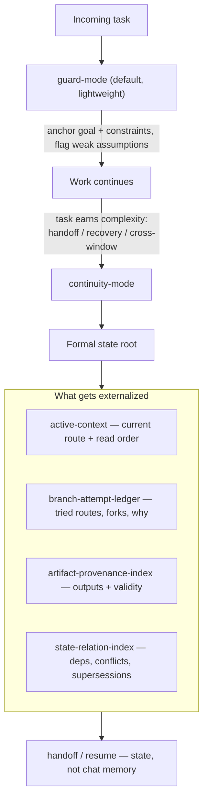

<!-- Language switch -->
**English** | [中文](./README.zh.md)

# Agent Continuity Harness (ACH)

**Continuity for AI agent work that outgrows one chat.**

Long-running agent work rarely fails on the *next step* — the model can still do
that. It fails on **continuity**: after a few rounds the goal drifts, assumptions
harden into facts, old constraints get overwritten by new information, and a
fresh chat can no longer recover what the task actually was.

ACH is the layer that decides *when* a conversation only needs a lightweight
guard, and *when* it needs formal, recoverable state. It starts light and
escalates only when the task earns it.



> **Design stance:** lightweight by default; formal state only when continuity
> is actually at risk. Users never pick an internal module — ACH decides.

<details>
<summary>Table of contents</summary>

- [The problem](#the-problem)
- [Why this exists](#why-this-exists)
- [How it works](#how-it-works)
- [The version tree](#the-version-tree)
- [Two surfaces](#two-surfaces)
- [Quick start](#quick-start)
- [Core concepts](#core-concepts)
- [Examples](#examples)
- [When to use it — and when not to](#when-to-use-it--and-when-not-to)
- [How ACH differs](#how-ach-differs)
- [Relationship to agent-drift-guard](#relationship-to-agent-drift-guard)
- [Design & attribution](#design--attribution)
- [License](#license)

</details>

---

## The problem

Long-running AI work tends to fail quietly:

- the goal drifts after several rounds;
- assumptions get treated as confirmed facts;
- old constraints are forgotten once new information arrives;
- a new chat cannot recover the real task state;
- handoffs depend on whatever happened to survive in chat history.

ACH targets exactly this narrow failure mode — the model can still produce the
next step, but the **task line** is losing continuity.

## Why this exists

ACH is **not** another prompt template, agent framework, or memory database.
Those answer "how do I phrase / build / store." ACH answers a different question:

> *When does this conversation still just need a lightweight guard, and when does
> it need formal, recoverable state?*

That decision is the whole product. Everything below is in service of making it
automatic and cheap.

## How it works

ACH runs in two internal modes and moves between them on its own.

**`guard-mode` (default, lightweight).** For normal multi-turn work. It keeps the
goal anchored, separates the user's goal from any *proposed* path, and flags weak
assumptions before they get inherited as facts. No files, no ceremony.

**`continuity-mode` (escalated).** Entered only when the task needs handoff,
recovery, a formal state root, or cross-window continuation. State is
**externalized** into a small state root so the next round — or the next person,
or the next chat — recovers from *state*, not from chat memory.

> **Observed problem → design judgment → trade-off**
>
> - **Goal drift** → externalize the *current route* into `active-context`
>   instead of leaving it implicit in history. *Trade-off:* one more file to keep
>   current, in exchange for a stable read order on recovery.
> - **Smuggled assumptions** → in guard-mode, hold "goal" and "proposed path"
>   apart and mark weak assumptions. *Trade-off:* slightly more friction now, far
>   less rework later.
> - **State loss** → a **write-to-use closure rule**: changing a file does *not*
>   count as recorded. A write is done only when future recovery can *find and
>   use* it through the default read path. *Trade-off:* writes are stricter, but
>   "we wrote it down and still lost it" stops happening.

The formal state root starts minimal — four recovery-core files plus
`state-manifest.json` — and grows supplemental documents **only when the task's
complexity justifies it**, so old branches never gain false authority during
recovery.

## The version tree

This is what separates ACH from a simple drift guard. A long task is not a
straight line; it evolves, forks, and sometimes backtracks. ACH tracks that shape
explicitly:

- **`branch-attempt-ledger`** — routes tried, competing assumptions, branches
  that were rejected or downgraded, and the diagnostic history behind them.
- **`state-relation-index`** — typed relationships: dependencies, conflicts,
  supersessions, invalidations, and correction impact.
- **`compiled-lineage`** — the durable reasoning for *why the current route
  exists*.

The point of recording **why a fork happened** is recovery integrity: without it,
a correction made now can let a stale assumption quietly come back later. The
version tree is what keeps superseded reasoning superseded.

## Two surfaces

ACH ships as two equal delivery surfaces over one continuity contract.

| Surface | Use it when | What you install |
| --- | --- | --- |
| **Agent skill** (`ach`) | You want an agent (Codex / Claude Code) to keep a long conversation stable automatically | The repository folder as one skill named `ach` |
| **Node CLI** (`ach`) | You want a workspace to hold validatable, recoverable state | The Node CLI (`node >= 20`) |

The CLI makes the contract *runnable* — it does not run agents; it creates,
validates, and reads formal state roots so handoff and resume can depend on state
instead of memory. Other clients can use ACH through the CLI and the state
contract even without skill support.

## Quick start

**As an agent skill** — just ask for it in the conversation:

```text
Use ACH for this task. Keep the current goal, confirmed constraints,
pending items, and handoff state stable across future rounds.
```

**As a CLI** — give a workspace recoverable state:

```bash
ach init my-long-task          # create the minimal formal state root
ach validate --task my-long-task
ach handoff my-long-task       # derive a compact handoff from state
ach pause my-long-task         # status + write-closure check + handoff
ach resume my-long-task        # check recovery readiness
```

ACH starts in `guard-mode`. It enters `continuity-mode` only when the task needs
recovery, handoff, a formal state root, or cross-window continuation.

> Full command reference: [`docs/cli.md`](docs/cli.md) ·
> install paths: [`docs/install.md`](docs/install.md) ·
> before/after proof: [`docs/demo.md`](docs/demo.md).

## Core concepts

For readers who want to actually use it, the recovery vocabulary in one place:

| Concept | What it holds |
| --- | --- |
| `active-context` | the current route, active constraints, artifacts, blockers, and read order |
| `branch-attempt-ledger` | tried routes, competing assumptions, rejected/downgraded forks |
| `artifact-provenance-index` | reusable outputs, sources, dependencies, validity, replacements |
| `state-relation-index` | dependencies, conflicts, supersessions, invalidations, correction impact |
| `compiled-lineage` | the durable reasoning for why the current route exists |
| write-to-use closure | a write counts only when future recovery can find and use it |

Recovery rule of thumb: read `active-context` for what's current; read the
`branch-attempt-ledger` only when tracing old hypotheses; read the
`artifact-provenance-index` when judging whether an output is still valid; read
the `state-relation-index` when a correction might affect related state.

## Examples

Each example shows the failure pattern first, then the ACH behavior that keeps
the task coherent.

- [Drift recovery](examples/01-drift-recovery.md)
- [Window handoff](examples/02-window-handoff.md)
- [Long-task checkpoint](examples/03-long-task-checkpoint.md)
- [When *not* to use ACH](examples/04-when-not-to-use.md)
- [Recovery failure without ACH](examples/07-recovery-failure.md)
- [Recovery with ACH](examples/08-recovery-with-ach.md)

## When to use it — and when not to

**Use ACH when you are thinking:**

- "This task will continue later, and I don't want to re-explain it."
- "The conversation is starting to drift — stabilize the boundary first."
- "I need to move this work into a new chat without losing state."
- "Someone else may have to take this over from the current point."

**Do not use ACH** for one-shot questions, simple edits, short lookups, or any
task where the next step is already obvious and low-risk. Formal state you don't
need is just overhead.

## How ACH differs

ACH is meant to complement existing tools, not replace them.

| Tool or pattern | Good at | What ACH adds |
| --- | --- | --- |
| `AGENTS.md` | project-level instructions for agents | runtime continuity rules for long tasks |
| Prompt templates | reusable wording | drift, handoff, and recovery *decisions* |
| Agent frameworks | building and running agents | continuity *inside* the work |
| Memory systems | storing facts/context | deciding *what* state must be formalized, and *when* |

See [`docs/faq.md`](docs/faq.md) for common comparison questions.

## Relationship to agent-drift-guard

ACH is the heavyweight evolution of
[**agent-drift-guard (adg)**](https://github.com/bagbag16/agent-drift-guard) — a
lightweight guard for goal drift in multi-turn AI collaboration. adg is the
proven, minimal entry point; ACH is what you reach for when the task grows into
state loss, smuggled assumptions, and forking task definitions.

## Design & attribution

The concept and design of ACH — the failure model, the guard/continuity split,
the version-tree approach to task evolution, and the write-to-use closure rule —
are by **bagbag16**, a game systems designer. The implementation was built with
AI pair-programming from that design. ACH is a record of design judgment, not of
hand-written code.

## License

MIT.
