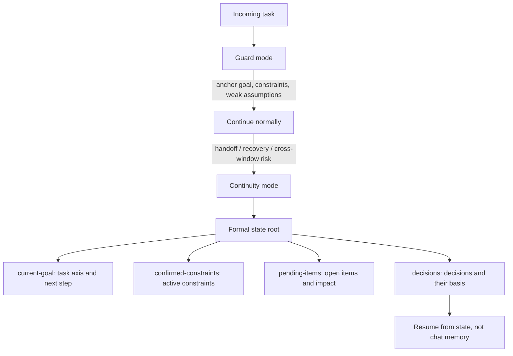

<!-- Language switch -->
**English** | [中文](./README.zh.md)

# Agent Continuity Harness (ACH)

**ACH keeps long-running AI work recoverable when one chat is no longer enough.**

Use ACH when an agent task may drift, pause, move across windows, or need another agent to resume it without guessing from chat history. ACH starts light, then creates formal state only when continuity is actually at risk.

ACH is not a project manager and not a memory dump. It is a continuity harness: it anchors the goal, records constraints, externalizes recoverable state, and makes handoff possible.



## Use It When

- A task will take many turns, windows, branches, or recovery attempts.
- The goal, constraints, evidence, or decisions must survive a restart.
- Another agent must resume the work without replaying the whole conversation.
- Drift is likely and the cost of losing context is higher than the cost of keeping state.

Do not use ACH for short questions, simple edits, or tasks where the current chat is enough.

## What It Does

1. Starts in `guard-mode`: keep the goal and constraints visible without creating heavy state.
2. Watches for continuity risk: handoff, recovery, branching, repeated failure, or cross-window work.
3. Enters `continuity-mode` only when needed.
4. Creates a state root that records the current route, decisions, attempts, evidence, and unresolved risks.
5. Lets a future agent resume from state instead of guessing from chat fragments.

## Core Files

Every formal state root contains four recovery-core files plus a machine-readable manifest. `ach init` creates all of them:

| File | Purpose |
| --- | --- |
| [current-goal](./assets/state-templates/current-goal.template.md) | Current task axis, phase, and next step |
| [confirmed-constraints](./assets/state-templates/confirmed-constraints.template.md) | Constraints that are confirmed and still active |
| [pending-items](./assets/state-templates/pending-items.template.md) | Open items, their impact, and whether they block progress |
| [decisions](./assets/state-templates/decisions.template.md) | Decisions made, what they change, and their basis |

Complex tasks can extend the root with optional supplemental documents — [active-context](./assets/state-templates/active-context.template.md), [branch-attempt-ledger](./assets/state-templates/branch-attempt-ledger.template.md), [artifact-provenance-index](./assets/state-templates/artifact-provenance-index.template.md), [state-relation-index](./assets/state-templates/state-relation-index.template.md) — via `ach add-supplemental`. See the [state contract](./docs/state-contract.md).

## Quick Start

Install the CLI and create state for a task:

```bash
npm install -g github:bagbag16/agent-continuity-harness
ach init my-long-task
ach status my-long-task
```

Or ask for ACH in conversation when continuity matters:

```text
Use ACH for this task. Start light, but create formal state if the work needs handoff, recovery, or cross-window continuation.
```

Expected behavior:

- The agent keeps ordinary work lightweight.
- The agent escalates only when the task earns formal state.
- The state root becomes the source of recovery, not the raw conversation.

More: [Install](./docs/install.md) | [Quickstart](./docs/quickstart.md) | [CLI reference](./docs/cli.md) | [FAQ](./docs/faq.md)

## Boundary

ACH manages continuity. It does not decide product strategy, replace task-specific validation, or make every task bureaucratic. If the work can finish cleanly in the current context, ACH should stay in guard mode.

ACH also does not judge whether the work is converging on its goal — that is semantic governance, not state. For autonomous loops, [loop-builder](https://github.com/bagbag16/loop-builder) designs that layer (acceptance criteria, independent supervision, stop conditions) on top of an ACH state root.

## License

MIT.
