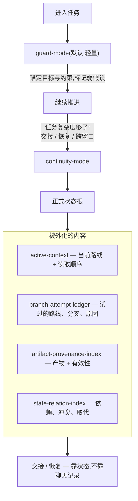

<!-- Language switch -->
[English](./README.md) | **中文**

# Agent Continuity Harness (ACH)

**为"长到一个对话装不下"的 AI 任务提供连续性。**

长任务很少栽在**下一步**——模型还做得动。它栽在**连续性**上:几轮之后目标漂移,
假设硬化成事实,旧约束被新信息冲掉,换一个新对话就再也恢复不出"这任务原本是什么"。

ACH 是这样一层:它判断一段对话**何时**只需要轻量护栏、**何时**需要正式且可恢复的
状态。默认很轻,只有任务确实需要时才升档。



> **设计立场:** 默认轻量;只有连续性真的有风险时才上正式状态。用户从不手选内部
> 模块——由 ACH 决定。

<details>
<summary>目录</summary>

- [问题](#问题)
- [为什么有它](#为什么有它)
- [它怎么工作](#它怎么工作)
- [版本树](#版本树)
- [两个交付面](#两个交付面)
- [快速开始](#快速开始)
- [核心概念](#核心概念)
- [示例](#示例)
- [何时用、何时别用](#何时用何时别用)
- [ACH 与其他工具的区别](#ach-与其他工具的区别)
- [与 agent-drift-guard 的关系](#与-agent-drift-guard-的关系)
- [设计与署名](#设计与署名)
- [许可证](#许可证)

</details>

---

## 问题

长任务的 AI 工作往往是**安静地**失效:

- 几轮之后目标漂移;
- 假设被当成已确认的事实;
- 新信息一来,旧约束就被忘掉;
- 新对话恢复不出真实的任务状态;
- 交接全靠"碰巧还留在聊天记录里"的东西。

ACH 只盯这个窄失效域——模型还能给出下一步,但**任务线**正在丢失连续性。

## 为什么有它

ACH **不是**又一个 prompt 模板、agent 框架或记忆数据库。那些回答的是"怎么措辞 /
怎么搭 / 怎么存"。ACH 回答的是另一个问题:

> *这段对话现在还只需要轻量护栏,还是已经需要正式、可恢复的状态了?*

这个判断本身就是整个产品。下面的一切,都是为了让这个判断**自动、且廉价**。

## 它怎么工作

ACH 有两个内部模式,并且**自己**在两者之间切换。

**`guard-mode`(默认,轻量)。** 用于普通多轮工作。它把目标锚住,把用户的目标和任何
**被提议的路径**分开,并在弱假设被继承为事实之前先标记出来。不落文件、不搞仪式。

**`continuity-mode`(升档)。** 只有任务需要交接、恢复、正式状态根或跨窗口延续时才
进入。状态被**外化**进一个小的状态根,于是下一轮——或下一个人、下一个对话——是从
**状态**恢复,而不是从聊天记录里捞。

> **观察到的问题 → 设计判断 → 取舍**
>
> - **目标漂移** → 把*当前路线*外化进 `active-context`,而不是留在历史里默认存在。
>   *取舍:* 多维护一个文件,换来恢复时有稳定的读取顺序。
> - **假设偷渡** → 在 guard-mode 里把"目标"和"提议路径"分开,并标记弱假设。
>   *取舍:* 当下多一点摩擦,后面少很多返工。
> - **状态丢失** → 一条 **write-to-use 闭合规则**:改了文件**不**等于记录完成。只有
>   未来恢复能沿默认读取路径**找到并用上**它,这次写入才算数。*取舍:* 写入更严,
>   但"我们明明写下来了却还是丢了"这件事不再发生。

正式状态根从最小起步——四个 recovery-core 文件加 `state-manifest.json`——并且**只在
任务复杂度证明必要时**才长出补充文档,这样旧分叉在恢复时永远不会获得"虚假权威"。

## 版本树

这是 ACH 区别于"普通漂移护栏"的地方。长任务不是一条直线;它会演化、分叉,有时回退。
ACH 把这个形状**显式**记下来:

- **`branch-attempt-ledger`** —— 试过的路线、竞争的假设、被否决或降级的分叉,以及它们
  背后的诊断历史。
- **`state-relation-index`** —— 带类型的关系:依赖、冲突、取代、失效、纠正影响。
- **`compiled-lineage`** —— *当前路线为何成立*的持久化推理。

记录**分叉为什么发生**,是为了恢复的完整性:没有它,此刻做的一次纠正,可能让一个过时
假设在之后悄悄复活。版本树就是那个让"已被取代的推理保持被取代"的东西。

## 两个交付面

ACH 以两个对等的交付面,落在同一套连续性契约之上。

| 交付面 | 何时用 | 装什么 |
| --- | --- | --- |
| **Agent skill**(`ach`) | 想让 agent(Codex / Claude Code)自动稳住一段长对话 | 把仓库目录作为一个名为 `ach` 的 skill |
| **Node CLI**(`ach`) | 想让某个工作区持有可校验、可恢复的状态 | Node CLI(`node >= 20`) |

CLI 让契约**可运行**——它不跑 agent;它创建、校验、读取正式状态根,好让交接和恢复
依赖状态而不是记忆。其他客户端即使不支持 skill,也能通过 CLI 与状态契约用上 ACH。

## 快速开始

**作为 agent skill** —— ACH 是一个可安装的 skill,不是一段复制粘贴的 prompt。装一次
([安装](docs/install.md)),之后在任何对话里直接说:

```text
Use ACH for this task. Keep the current goal, confirmed constraints,
pending items, and handoff state stable across future rounds.
```

**作为 CLI** —— 给工作区一份可恢复状态:

```bash
ach init my-long-task          # 创建最小正式状态根
ach validate --task my-long-task
ach handoff my-long-task       # 从状态派生一份紧凑交接
ach pause my-long-task         # status + 写入闭合检查 + 交接
ach resume my-long-task        # 检查恢复就绪度
```

ACH 从 `guard-mode` 起步。只有任务需要恢复、交接、正式状态根或跨窗口延续时,才进入
`continuity-mode`。

> CLI 暂无 npm 发布,从 GitHub 安装(`npm i -g github:bagbag16/agent-continuity-harness`)
> —— 见[安装](docs/install.md)。
>
> 完整命令参考:[`docs/cli.md`](docs/cli.md) ·
> before/after 实证:[`docs/demo.md`](docs/demo.md)。

## 核心概念

给真想用的人,把恢复词表放一处:

| 概念 | 它装什么 |
| --- | --- |
| `active-context` | 当前路线、活动约束、产物、阻塞项、读取顺序 |
| `branch-attempt-ledger` | 试过的路线、竞争假设、被否/降级的分叉 |
| `artifact-provenance-index` | 可复用产物、来源、依赖、有效性、替代关系 |
| `state-relation-index` | 依赖、冲突、取代、失效、纠正影响 |
| `compiled-lineage` | 当前路线为何成立的持久推理 |
| write-to-use 闭合 | 只有未来恢复能找到并用上,这次写入才算数 |

恢复时的经验法则:看 `active-context` 知道当前是什么;只有在追溯旧假设时才看
`branch-attempt-ledger`;判断某个产物是否还有效时看 `artifact-provenance-index`;
某次纠正可能波及相关状态时看 `state-relation-index`。

## 示例

每个示例都先给失效模式,再给 ACH 让任务保持自洽的行为。

- [漂移恢复](examples/01-drift-recovery.md)
- [窗口交接](examples/02-window-handoff.md)
- [长任务检查点](examples/03-long-task-checkpoint.md)
- [何时*不要*用 ACH](examples/04-when-not-to-use.md)
- [没有 ACH 的恢复失败](examples/07-recovery-failure.md)
- [有 ACH 的恢复](examples/08-recovery-with-ach.md)

## 何时用、何时别用

**当你在想这些时,用 ACH:**

- "这任务以后还要继续,我不想重新解释一遍。"
- "对话开始漂了——先把边界稳住。"
- "我得把这活挪进一个新对话,又不丢状态。"
- "可能会有别人从当前这个点接手。"

**别用 ACH** 处理一次性问答、简单编辑、短查询,或任何下一步已经显然且低风险的任务。
你不需要的正式状态,只是额外开销。

## ACH 与其他工具的区别

ACH 旨在补充现有工具,而非取代它们。

| 工具或模式 | 擅长 | ACH 补什么 |
| --- | --- | --- |
| `AGENTS.md` | 给 agent 的项目级指令 | 长任务的运行时连续性规则 |
| Prompt 模板 | 可复用的措辞 | 漂移、交接、恢复的**决策** |
| Agent 框架 | 搭建与运行 agent | 工作**内部**的连续性 |
| 记忆系统 | 存事实/上下文 | 决定**哪些**状态必须正式化、以及**何时** |

常见对比问题见 [`docs/faq.md`](docs/faq.md)。

## 与 agent-drift-guard 的关系

ACH 是 [**agent-drift-guard (adg)**](https://github.com/bagbag16/agent-drift-guard)
的重型演进版——adg 是面向多轮 AI 协作目标漂移的轻量护栏,是已被验证的极简入口;当任务
长成"状态丢失、假设偷渡、任务定义分叉"时,你伸手去拿的就是 ACH。

## 设计与署名

ACH 的概念与设计——失效模型、guard / continuity 的分档、用版本树看待任务演化的思路,
以及 write-to-use 闭合规则——由 **bagbag16**(游戏数值/系统设计师)完成。实现是在该
设计之上用 AI 结对编程构建的。ACH 记录的是设计判断,而非手写代码。

## 许可证

MIT。
