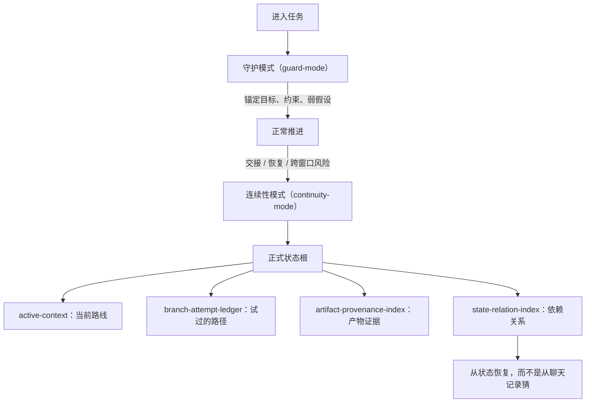

<!-- Language switch -->
[English](./README.md) | **中文**

# Agent Continuity Harness (ACH)

**ACH 让长任务在一个对话装不下时仍然可恢复、可交接、可继续。**

当一个 Agent 任务可能漂移、暂停、跨窗口、换人接手，或需要从中断中恢复时，用 ACH。它默认很轻；只有连续性真的有风险时，才创建正式状态。

ACH 不是项目管理器，也不是聊天记录备份。它是连续性护栏：锚定目标，记录约束，外化可恢复状态，让后续 Agent 不必靠猜来续上任务。



## 何时使用

- 任务会跨很多轮、很多窗口、很多分支或多次恢复。
- 目标、约束、证据或决策必须在重启后仍然可用。
- 另一个 Agent 需要接手，而不能重读整段聊天。
- 漂移风险高，丢上下文的代价高于维护状态的代价。

短问答、简单修改、当前对话能收完的任务，不需要 ACH。

## 它做什么

1. 默认进入 `guard-mode`：保持目标和约束可见，但不制造重状态。
2. 观察连续性风险：交接、恢复、分支、多次失败、跨窗口工作。
3. 只有必要时才进入 `continuity-mode`。
4. 创建状态根，记录当前路线、决策、尝试、证据和未解风险。
5. 让后续 Agent 从状态恢复，而不是从聊天片段里猜。

## 核心文件

| 文件 | 用途 |
| --- | --- |
| `active-context` | 当前目标、路线、读取顺序和下一步 |
| `branch-attempt-ledger` | 试过的路线、分叉、失败及其原因 |
| `artifact-provenance-index` | 产物、证据来源、有效性和过期条件 |
| `state-relation-index` | 依赖、冲突、取代关系和恢复链接 |

## 快速开始

当连续性重要时这样要求：

```text
Use ACH for this task. Start light, but create formal state if the work needs handoff, recovery, or cross-window continuation.
```

预期行为：

- 普通推进保持轻量。
- 只有任务真的需要时才升到正式状态。
- 状态根成为恢复来源，而不是原始聊天记录。

## 边界

ACH 只负责连续性。它不替代产品判断、不替代任务专属验证，也不把每个任务都变成流程文档。当前上下文能干净收完的任务，应停留在守护模式。

## 许可证

MIT。
