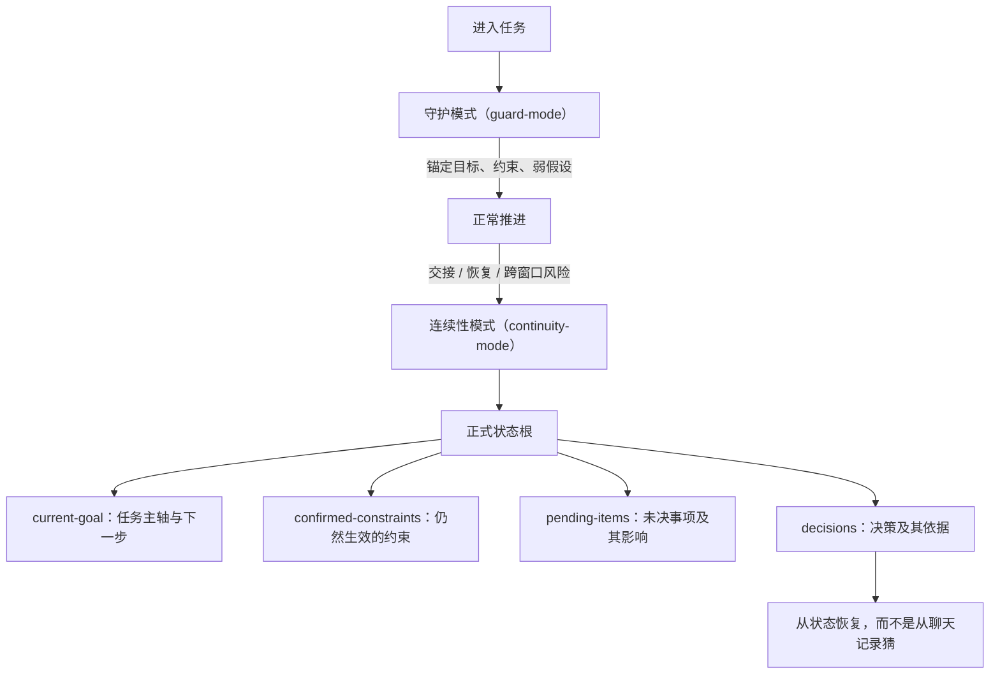

<!-- Language switch -->
[English](./README.md) | **中文**

# Agent Continuity Harness (ACH)

**ACH 让长任务在一个对话装不下时仍然可恢复、可交接、可继续。**

当一个 Agent 任务可能漂移、暂停、跨窗口、换人接手，或需要从中断中恢复时，用 ACH。它默认很轻；只有连续性真的有风险时，才创建正式状态。

ACH 不是项目管理器，也不是聊天记录备份。它是连续性护栏：锚定目标，记录约束，外化可恢复状态，让后续 Agent 不必靠猜来续上任务。



## 何时使用

- 任务会跨很多轮、很多窗口、很多分支或多次恢复。
- 目标、约束、证据或决策必须在重启后仍然可用。
- 另一个 Agent 需要接手，而不能重读整段聊天。
- 漂移风险高，丢上下文的代价高于维护状态的代价。

短问答、简单修改、当前对话能收完的任务，不需要 ACH。

## 它做什么

1. 默认进入 `guard-mode`：保持目标和约束可见，但不制造重状态。
2. 观察连续性风险：交接、恢复、分支、多次失败、跨窗口工作。
3. 只有必要时才进入 `continuity-mode`。
4. 创建状态根，记录当前路线、决策、尝试、证据和未解风险。
5. 让后续 Agent 从状态恢复，而不是从聊天片段里猜。

## 核心文件

每个正式状态根包含四个恢复核心文件和一个机器可读的 manifest，`ach init` 会全部创建：

| 文件 | 用途 |
| --- | --- |
| [current-goal](./assets/state-templates/current-goal.template.md) | 当前任务主轴、阶段和下一步 |
| [confirmed-constraints](./assets/state-templates/confirmed-constraints.template.md) | 已确认且仍然生效的约束 |
| [pending-items](./assets/state-templates/pending-items.template.md) | 未决事项、影响范围、是否阻塞 |
| [decisions](./assets/state-templates/decisions.template.md) | 做过的决策、改变了什么、依据是什么 |

复杂任务可以通过 `ach add-supplemental` 追加可选的补充文档 —— [active-context](./assets/state-templates/active-context.template.md)、[branch-attempt-ledger](./assets/state-templates/branch-attempt-ledger.template.md)、[artifact-provenance-index](./assets/state-templates/artifact-provenance-index.template.md)、[state-relation-index](./assets/state-templates/state-relation-index.template.md)。详见[状态契约](./docs/state-contract.md)。

## 快速开始

安装 CLI 并为一个任务建立状态：

```bash
npm install -g github:bagbag16/agent-continuity-harness
ach init my-long-task
ach status my-long-task
```

或者在对话里直接要求（当连续性重要时）：

```text
Use ACH for this task. Start light, but create formal state if the work needs handoff, recovery, or cross-window continuation.
```

预期行为：

- 普通推进保持轻量。
- 只有任务真的需要时才升到正式状态。
- 状态根成为恢复来源，而不是原始聊天记录。

更多：[安装](./docs/install.md) | [快速上手](./docs/quickstart.md) | [CLI 参考](./docs/cli.md) | [FAQ](./docs/faq.md)

## 强制等级

依赖 agent"记得遵守"的规则是最弱的规则。ACH 给每个机制标注真实的强制方式，并诚实承认哪些仍停留在散文层：

| 机制 | 等级 | 由什么强制 |
| --- | --- | --- |
| 状态根形状、绑定、manifest 完整性 | **门禁** | `ach validate` / `preflight` 失败时阻断交接与恢复 |
| 状态新鲜度（现实被记录了吗） | **推导 + 门禁** | `ach reconcile` 从文件 mtime 推导漂移——地面真相，不信自报；自带的 [Claude Code 停止门禁](./docs/integrations/claude-code.md#stop-gate-mechanical-enforcement)在活跃任务状态过期时拒绝结束会话 |
| 产物溯源一致性 | **推导** | `ach artifact check` 用 active context 对照校验索引 |
| 任务中途 checkpoint 纪律 | **散文** | SKILL.md 约定——已知弱点，由停止门禁部分补偿 |
| 守护模式→连续性模式的升级判断 | **散文** | SKILL.md 约定——有意留给判断 |

等级说明：**门禁** = 机械阻断；**推导** = 从 agent 无法改写的证据计算；**审计** = 事后度量；**散文** = 依赖 agent 遵守指令。

## 边界

ACH 只负责连续性。它不替代产品判断、不替代任务专属验证，也不把每个任务都变成流程文档。当前上下文能干净收完的任务，应停留在守护模式。

ACH 也不判断工作是否在朝目标收敛——那是语义治理，不是状态。对自治 loop，[loop-builder](https://github.com/bagbag16/loop-builder) 在 ACH 状态根之上设计这一层（验收标准、独立监管、停止条件）。

## 许可证

MIT。
